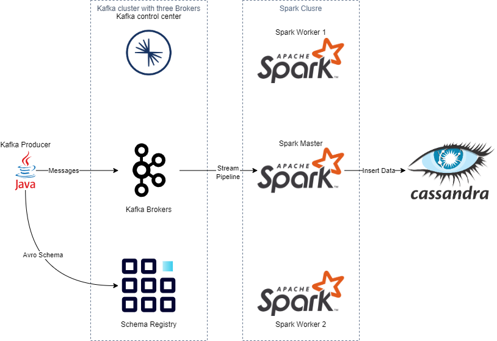

# kafka-spark-streaming-pipeline
In this project, I tried to mimic a real-world scenario by building a Kafka to spark streaming pipeline by building the infrastructure by docker-compose.

I chose to use java kafka producer because it has some advantages making it the best choice when it comes to working with schema registry (maven plugins can generate classes from the Avro schema making it easy to generate Kafka messages from java objects)

I build the Kafka cluster on Kraft mode so no need for Zookeeper for cluster management.



# How to use the project in local environment?

### Prerequists:
- Docker engine
- java 17

## Building The Infrastructure
The magic begins when you run the [docker-compose](docker-compose.yaml) file
 ```
docker-compose up
 ```

## Start working with kafka & spark
Afte building the infrastructurer by docker compose successfully, you can start the work flow by creating kafka topic: <br>
- I created a kafka topic with only one partition & three replicas. 
- you can use any kafka broker to do that , not only kafka1
 ```
docker exec kafka1 kafka-topics \
 --bootstrap-server localhost:9092 \
  --topic FakeUsers --create \
   --partitions 1 --replication-factor 3
 ```
We need now to install some packages on spark master node to connect to kafak & cassandra:
- confluent_kafka : to connect to kafka brokers
- requests: to get the avro schema from schema registry
- cassandra-driver: to connect to cassanfra
```
docker exec op-spark-master-1 \
 pip install requests confluent_kafka cassandra-driver
```

Then we copy the [spark_consumer](SprkCode/spark_consumer.py) python script to spark master node to run it later.
```
docker cp -L SprkCode/spark_consumer.py \
 op-spark-master-1:/opt/bitnami/spark/spark_consumer.py
```

Now, we need to get the address where our spark master is running.
Run the following command .the output will have info like the following line.

```
docker logs op-spark-master-1
INNFO Master: Starting Spark master at spark://172.19.0.5:7077
```

Finally we should submit the spark job with the suitable jars to deal with kafka & cassandra

```
docker exec op-spark-master-1 spark-submit \
 --packages org.apache.spark:spark-sql-kafka-0-10_2.12:3.5.0,org.apache.spark:spark-avro_2.12:3.5.0,com.datastax.spark:spark-cassandra-connector_2.12:3.4.0 \
 --master spark://172.19.0.5:7077 spark_consumer.py
```
> [!WARNING] 
> the submitted packages jars has naming convention as groupId:artifactId:version:
> - artifactId contins of packageName_scalaVersion .scalaVersion must be the same used in the spark . In the case of kafka package kafka & spark must use the same scala version. In this project. I use kafka 7.5.2 & spark 3.5.0 and the both use scala 2.12 .
> - version is the spark version used in the spark cluster or the most closest one like on the cassandra jar I used the 3.4.0 version because I didn't find jar has the latest spark version 3.5.0 .

## Start the real work
Now we built the Infrastructure and the relative components and we are ready to start sending messages , processing them and iserting them to cassandra.

To run the kafka java producer you simply run the kafkaProducer jar
```
java -jar kafakaSchemaRegistry/target/kafkaProducer.jar
```

 


